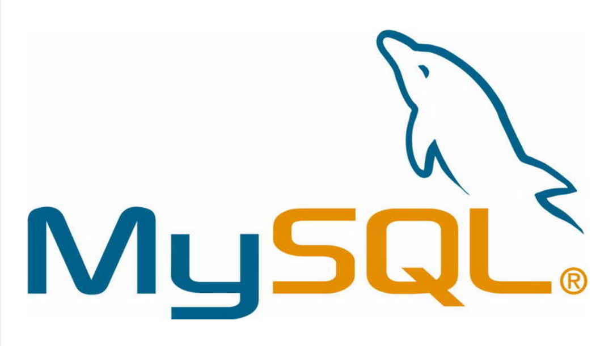

## MySQL数据库

`MySQL`是一款广泛应用的开源关系型数据库管理系统（`RDBMS`），由瑞典公司`MySQL AB` 开发。`MySQL`的特点包括开源、性能良好、稳定性高、支持标准SQL语言等。由于这些特性，`MySQL`成为了许多Web应用和企业级应用的首选数据库系统之一。

在2008年，`Sun Microsystems`（甲骨文公司的前身）收购了`MySQL AB`。然后，在2010年，`Oracle Corporation`收购了`Sun Microsystems`，从而使`MySQL`成为`Oracle`旗下的产品。

MySQL的普及度高，部分原因包括：

1. **开源性质**： `MySQL`是开源的，用户可以自由获取、使用、修改和分发`MySQL`的源代码。这使得它成为许多开发者和组织的首选，同时也促进了其广泛的社区支持。
2. **性能和稳定性**： `MySQL`以其高性能和稳定性而闻名，适用于各种规模的应用。它在处理大量事务和高并发访问时表现良好。
3. **跨平台**： `MySQL`可以在多个操作系统上运行，包括`Linux`、`Windows`、`macOS`等，使其更具灵活性。
4. **社区支持**： 有一个庞大的`MySQL`开发者社区，提供了丰富的文档、教程和技术支持，使用户能够更轻松地学习和使用`MySQL`。
5. **广泛应用于Web开发**： `MySQL`常用于支持`Web`应用程序的后端数据库，包括一些著名的网站和应用，如`Facebook`、`WordPress`等。



总体而言，MySQL在开源关系型数据库领域具有重要地位，被广泛应用于各种场景，从小型网站到大型企业应用。

## 安装MySQL

安装MySQL的步骤不难，可自行百度。

> MySQL官网下载地址：[https://www.mysql.com/downloads/](https://www.mysql.com/downloads/)


# Windows下重设root账户密码

下面，记录一下我在Windows系统下重设root账户密码的步骤。

首先，创建一个TXT文件，定义修改密码的SQL语句。

```sql
ALTER USER 'root'@'localhost' IDENTIFIED BY '123456';
```

这里将密码修改为 `123456`，我将这个文件保存为 `D:/temp.txt`。

接着，在Windows窗口的左下角田字格图标上，右键点击，在选项中选择`Windows终端（管理员）`。

打开终端（`Windows PowerShell`）后，运行以下命令，停止MySQL服务：

```shell
PS C:\Users\dev> net stop mysql80
MySQL80 服务正在停止..
MySQL80 服务已成功停止。
```

接着运行 `mysqld` 命令，修改root账户密码：

```shell
PS C:\Users\dev> mysqld --defaults-file="C:\ProgramData\MySQL\MySQL Server 8.0\my.ini" --init-file="D:/temp.txt" --console
```

成功运行后，我们按住 `Ctrl+C`退出服务，然后关闭这个窗口即可。

下面，我们就可以测试`root`账户是否修改密码成功了。

> 注意：
> 
> 由于之前配置了`MySQL`环境变量，因此在任意目录下都可以运行`MySQL`的命令，比如上面这个 `mysqld`命令。
> 
> 如果你没有配置环境变量`path`，可将`MySQL`安装目录下的`bin`目录地址配置到环境变量`path`中，一般为`C:\Program Files\MySQL\MySQL Server 8.0\bin`。

最后一步操作，以管理员的身份重新打开一个`Windows PowerShell`窗口，接着启动`MySQL`服务：

```shell
PS C:\Users\dev> net start mysql80
MySQL80 服务正在启动 .
MySQL80 服务已经启动成功。
```

好了，大功告成。